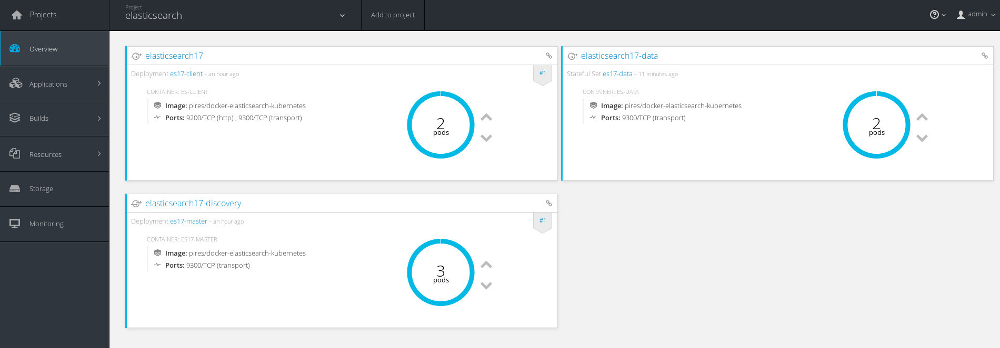

oc create -f scc-elasticsearch.yaml
oc adm policy add-scc-to-user scc-elasticsearch system:serviceaccount:business:default
oc policy add-role-to-user view system:serviceaccount:business:default
oc create -f es-discovery-svc.yaml
oc create -f es-svc.yaml
oc create -f es-master.yaml
oc create -f es-client.yaml
oc create -f es-data-svc.yaml
oc create -f es-data-stateful.yaml


# Stateful Elasticsearch Cluster on Openshift

[Openshift Origin](https://www.openshift.org/) is built around a core of [Docker](https://www.docker.com/) container packaging and [Kubernetes](https://kubernetes.io/) container cluster management, Origin is also augmented by application lifecycle management functionality and [DevOps](https://en.wikipedia.org/wiki/DevOps) tooling. Origin provides a complete open source container application platform.

At [Linkbynet](http://linkbynet.com/) we're using [Openshift](http://thewatchmakers.fr/openshift-fail-fast-succeed-faster/) and [devops](http://thewatchmakers.fr/devops-cest-pas-faux/) for some of our customers and tools.

By convention wisdom says that container are stateless. But that's not true anymore. Kubernetes 1.5 (Openshift Origin 1.5.1 embeded kubernetes 1.5.2) includes the new StatefulSet API object (in previous versions, StatefulSet was known as PetSet). With StatefulSets, Kubernetes makes it much easier to run stateful workloads such as databases.

In this use case, we will deploy a stateful [elasticsearch cluster](https://www.elastic.co/products/elasticsearch) on Openshift Origin on [Amazon Aws](https://aws.amazon.com/).

### Table of Contents

* [Abstract](#abstract)
* [Pre-Requisites](#pre-requisites)
* [Connect](#connect-to-openshift)
* [Create project](#create-a-new-project)
* [Create SecurityContextConstraints](#create-securitycontextconstraints)
* [Allow user read of kubernetes API](#add-scc-context-to-allow-user-read-of-kubernetes-api)
* [Discovery service](#deploy-discovery-service)
* [Client service](#deploy-client-service)
* [Master nodes](#deploy-master-nodes)
* [Client nodes](#deploy-client-nodes)
* [StorageClass](#create-storageclass)
* [Headless Service](#headless-service)
* [Data nodes](#deploy-data-nodes)
* [Checks](#check-everything)

## Abstract

Our Elasticsearch cluster will be :
* Three `Master` nodes - intended for clustering management only, no data, no HTTP API
* Two `Client` nodes - intended for client usage, no data, with HTTP API
* Two `Data` nodes - intended for storing and indexing data, no HTTP API

Statefulset are **Technology Previous** on Openshift Origin 1.5, it's not anymore on 1.6.

 

## Pre-requisites

* [Openshift Origin 1.5 cluster](https://docs.openshift.org/1.5/install_config/install/planning.html)
* [Configure your cluster](https://docs.openshift.org/1.5/install_config/configuring_aws.html) for AWS

## Connect to openshift

```bash
$ oc login https://master-openshift.linkbynet.com:8443/                                                                                                                                                                                      ~/cmg/elk
Authentication required for https://master-openshift.linkbynet.com:8443 (openshift)
Username: admin
Password:
Login successful.

You have access to the following projects and can switch between them with 'oc project <projectname>':

  * default
    kube-system
    logging
    management-infra
    openshift
    openshift-infra

Using project "default".
```

## Create a new project

```bash
$ oc new-project elasticsearch                                                                                                                                                                                                               ~/cmg/elk
Now using project "elasticsearch" on server "https://master-openshift.linkbynet.fr:8443".

You can add applications to this project with the 'new-app' command. For example, try:

    oc new-app centos/ruby-22-centos7~https://github.com/openshift/ruby-ex.git

to build a new example application in Ruby.

```

## Create SecurityContextConstraints
 
Security context constraints allow administrators to control permissions for pods. To learn more about this API type, see the security context constraints (SCCs) architecture documentation. You can manage SCCs in your instance as normal API objects using the CLI.
 
Elasticsearch pods need :

* Elasticsearch pods need for an init-container to run in privileged mode, so it can set some VM options. For that to happen, the kubelet should be running with args --allow-privileged, otherwise the init-container will fail to run (https://github.com/pires/kubernetes-elasticsearch-cluster#very-important-notes).
* Some specific capabilities: IPC_LOCK, SYS_RESOURCE (https://docs.openshift.org/1.5/admin_guide/manage_scc.html#provide-additional-capabilities)

```bash
$ oc create -f scc-elasticsearch.yaml
securitycontextconstraints "scc-elasticsearch" created

```

Add the new scc to the user who run pods on our project user `default`


```bash
$ oc adm policy add-scc-to-user scc-elasticsearch system:serviceaccount:elasticsearch:default

```

## Add scc context to allow user read of kubernetes API

The Kubernetes Cloud plugin allows to use Kubernetes API for the unicast discovery mechanism (https://github.com/fabric8io/elasticsearch-cloud-kubernetes/tree/elasticsearch-cloud-kubernetes-1.3.0).


```bash
$ oc policy add-role-to-user view system:serviceaccount:elasticsearch:default
role "view" added: "system:serviceaccount:elasticsearch:default"
```

## Deploy discovery service

The discovery service is used by the Kubernetes cloud plugin to discover the member of the elasticsearch cluster. The name of discovery service is setup in environment variable `DISCOVERY_SERVICE`. 

```bash
$ oc create -f es-discovery-svc.yaml
service "elasticsearch-discovery" created

```
## Deploy client service

That service will loadbalance between all elasticsearch instance to give you access to REST API of elasticsearch. If you need to make it public, just had a route on this service (You will probably need to setup some security control).

```bash
$ oc create -f es-svc.yaml
service "elasticsearch" created

```

## Deploy Master nodes

```bash
$ oc create -f es-master.yaml
deployment "es-master" created

```

Wait until es-master deployment is provisioned, and

## Deploy Client nodes

```bash
$ oc create -f es-client.yaml
deployment "es-client" created

```

## Create StorageClass

The StorageClass resource object describes and classifies storage that can be requested, as well as provides a means for passing parameters for dynamically provisioned storage on demand. StorageClass objects can also serve as a management mechanism for controlling different levels of storage and access to the storage (https://docs.openshift.org/1.5/install_config/persistent_storage/dynamically_provisioning_pvs.html).

You can use a lot of [storage provider](https://docs.openshift.org/1.5/install_config/persistent_storage/dynamically_provisioning_pvs.html#available-dynamically-provisioned-plug-ins) :

* OpenStack Cinder
* AWS Elastic Block Store (EBS)
* GCE Persistent Disk (gcePD)
* GlusterFS
* Ceph RBD
* Trident from NetApp 

Have we said, we're using AWS so we will use [AWS Elastic Block Store has StorageClass](https://docs.openshift.org/1.5/install_config/persistent_storage/dynamically_provisioning_pvs.html#aws-elasticblockstore-ebs).

The configuration for the StorageClass looks like this [`aws-storage-class.yaml`](aws-storage-class.yaml):

```yaml
kind: StorageClass
apiVersion: storage.k8s.io/v1beta1
metadata:
  name: ssd
provisioner: kubernetes.io/aws-ebs
parameters:
  type: gp2
  zone: ap-southeast-1a
```

This configuration creates a new StorageClass called `ssd` that is backed by SSD volumes. The StatefulSet can now request a volume, and the StorageClass will automatically create it!

```bash
$ oc create -f aws-storage-class.yaml
storageclass "ssd" created

```

## Headless Service

Now you have created the Storage Class, you need to make a Headless Service. These are just like normal Kubernetes Services, except they don’t do any load balancing for you. When combined with StatefulSets, they can give you unique DNS addresses that let you directly access the pods.

The configuration for the Headless Service looks like this [`es-data-svc.yaml`](es-data-svc.yaml):

```yaml
apiVersion: v1
kind: Service
metadata:
  name: elasticsearch-data
  labels:
    component: elasticsearch
    role: data
spec:
  ports:
  - port: 9300
    name: transport
  clusterIP: None
  selector:
    component: elasticsearch
    role: data
```

You can tell this is a Headless Service because the clusterIP is set to “None.” Other than that, it looks exactly the same as any normal Kubernetes Service


```bash
$ oc create -f es-data-svc.yaml
service "elasticsearch-data" created

```

## Deploy Data nodes

The StatefulSet actually runs Data nodes and orchestrates everything together. Unlike Kubernetes ReplicaSets, pods created under a StatefulSet have a few unique attributes. The name of the pod is not random, instead each pod gets an ordinal name (es-data-0, es-data-1, ...). Combined with the Headless Service, this allows pods to have stable identification.

```yaml
apiVersion: apps/v1beta1
kind: StatefulSet

# Full yaml in repository

        volumeMounts:
        - name: storage
          mountPath: /data
  volumeClaimTemplates:
  - metadata:
      name: storage
      annotations:
        volume.beta.kubernetes.io/storage-class: ssd
    spec:
      accessModes: [ "ReadWriteOnce" ]
      resources:
        requests:
          storage: 20Gi
```

The [`es-data-stateful.yaml`](es-data-stateful.yaml) file contains a volumeClaimTemplates section which requests a 20 GB disk. Consider modifying the disk size to your needs.


```bash
$ oc create -f es-data-stateful.yaml
statefulset "es-data" created

```

Openshift Origin (in fact behind the scene it's Kubernetes which does the work) creates the pods for a StatefulSet one at a time, waiting for each to come up before starting the next, so it may take a few minutes for all pods to be provisioned.

## Check everything



# List of services

```bash
$ oc get services
NAME                        CLUSTER-IP       EXTERNAL-IP        PORT(S)          AGE
elasticsearch             172.30.56.239    a055729f57f1d...   9200:32029/TCP   49m
elasticsearch-data        None             <none>             9300/TCP         38m
elasticsearch-discovery   172.30.151.107   <none>             9300/TCP         50m
```

# List of pods

List of pods, 3 masters, 2 clients and 2 data nodes

```bash
$ oc get pods                                                                                                                         ~/Lbn/github/openshift-stateful-elasticsearch-cluster-on-aws
NAME                           READY     STATUS    RESTARTS   AGE
es-client-3622950126-93r2z   1/1       Running   0          39m
es-client-3622950126-gqzbd   1/1       Running   0          39m
es-data-0                    1/1       Running   0          4m
es-data-1                    1/1       Running   0          3m
es-master-548006985-bzbwr    1/1       Running   0          41m
es-master-548006985-t23kh    1/1       Running   0          41m
es-master-548006985-zjzjb    1/1       Running   0          41m
```

# List of pvc

You can see the persistent storage created :

```bash
$ oc get pvc                                                                                                                              ~/Lbn/github/openshift-stateful-elasticsearch-cluster-on-aws
NAME                  STATUS    VOLUME                                     CAPACITY   ACCESSMODES   AGE
storage-es-data-0   Bound     pvc-2d490b99-7f23-11e7-97c6-0234a946c861   20Gi       RWO           3m
storage-es-data-1   Bound     pvc-2d5729ba-7f23-11e7-97c6-0234a946c861   20Gi       RWO           3m
```

# Check elasticsearch status

And check you cluster status elasticsearch cluster status :

```bash
/ # wget -q -O - http://127.0.0.1:9200/_cluster/health?pretty                                                                                                                                                                          
{                                                                                                                                                                                                                                      
  "cluster_name" : "elasticsearch",                                                                                                                                                                                                    
  "status" : "green",                                                                                                                                                                                                                  
  "timed_out" : false,                                                                                                                                                                                                                 
  "number_of_nodes" : 7,                                                                                                                                                                                                               
  "number_of_data_nodes" : 2,                                                                                                                                                                                                          
  "active_primary_shards" : 0,                                                                                                                                                                                                         
  "active_shards" : 0,                                                                                                                                                                                                                 
  "relocating_shards" : 0,                                                                                                                                                                                                             
  "initializing_shards" : 0,                                                                                                                                                                                                           
  "unassigned_shards" : 0,                                                                                                                                                                                                             
  "delayed_unassigned_shards" : 0,                                                                                                                                                                                                     
  "number_of_pending_tasks" : 0,                                                                                                                                                                                                       
  "number_of_in_flight_fetch" : 0                                                                                                                                                                                                      
}
```

If you want to go further, go see :
 
 * [pires/kubernetes-elasticsearch-cluster](https://github.com/pires/kubernetes-elasticsearch-cluster),
 * [Kubernetes tutorials on stateful-application](https://kubernetes.io/docs/tutorials/stateful-application/basic-stateful-set/#creating-a-statefulset).
 * [Build mongodb on kubernetes with statefulsets](http://blog.kubernetes.io/2017/01/running-mongodb-on-kubernetes-with-statefulsets.html)
 
 

